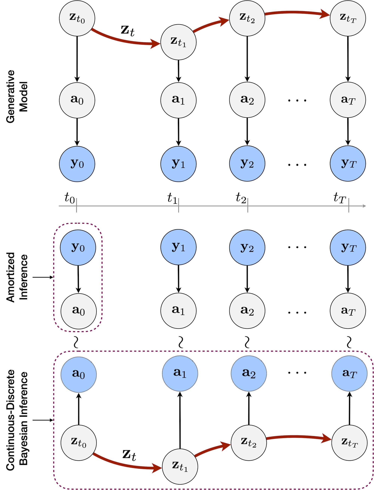

<div align="center">

# Neural Continuous-Discrete State Space Models (NCDSSM) 

[](https://arxiv.org/abs/2301.11308)
[](https://opensource.org/licenses/MIT)
[](https://icml.cc/)

</div>

<p align="center">
  
  <br />
  <span>Fig 1. (Top) Generative model of Neural Continuous-Discrete State Space Model. (Bottom) Amortized inference for auxiliary variables and continuous-discrete Bayesian inference for states.</span>
</p>

____
This repository contains code for reproducing the experiments presented in the ICML 2023 paper [*Neural Continuous-Discrete State Space Models for Irregularly-Sampled Time Series*](https://arxiv.org/abs/2301.11308).

## Installation

NCDSSM requires Python 3.8 or higher.

* Create a conda environment (optional, but recommended).
```sh
conda create --name ncdssm python=3.9
conda activate ncdssm
```
* Clone this repo and install the package.
```sh
# Install package with all optional dependencies for running experiments
pip install --editable ".[exp]"
```

## Usage
### Generate or download datasets

* For bouncing ball, damped pendulum, climate and Pymunk datasets, generate/download them by running the scripts in `data/`. 
```sh
# Bouncing Ball dataset
python data/bouncing_ball.py

# Damped Pendulum dataset
python data/damped_pendulum.py

# USHCN Climate dataset
python data/climate.py

# Pymunk datasets
python data/box.py
python data/pong.py
```
* For CMU MoCap dataset, download the preprocessed dataset (the file named `mocap35.mat`) available at [cagatayyildiz/ODE2VAE](https://github.com/cagatayyildiz/ODE2VAE) and place it in `data/mocap/mocap35.mat`.

### Training

Train models using `train_pymunk.py --config /path/to/config` for the Pymunk datasets and `train_ts.py --config /path/to/config` for all other datasets. The yaml config files can be found in `configs/`. The keys in the config files can also be passed as command line options to the training script as `--key value`.
```sh
# Train NCDSSM-NL on Damped Pendulum with 30% missing
python train_ts.py --config configs/pendulum_ncdssmnl.yaml --train_missing_p 0.3

# Train NCDSSM-LL on Bouncing Ball with 80% missing
python train_ts.py --config configs/ball_ncdssmll.yaml --train_missing_p 0.8

# Train NCDSSM-NL on CMU MoCap (setup 1)
python train_ts.py --config configs/mocap_ncdssmnl.yaml

# Train NCDSSM-LL on CMU MoCap (setup 2)
python train_ts.py --config configs/mocap2_ncdssmll.yaml

# Train NCDSSM-NL on USHCN Climate (first fold)
# --sporadic means that data is missing both in time and feature dimensions
python train_ts.py --sporadic --config configs/climate_ncdssmnl.yaml --data_fold 0

# Train NCDSSM-LL on Box
python train_pymunk.py --config configs/box_ncdssmll.yaml
```

### Evaluation

Once trained, models can be evaluated on the test set using the `eval_pymunk.py` and `eval_ts.py`. Alternatively, you may download our pretrained checkpoints from this repository's Releases or from [:hugs: hugging face](https://huggingface.co/abdulfatir/NCDSSM) and place them in `./checkpoints/`.
```sh
# Download pretrained checkpoint from Releases
wget https://github.com/clear-nus/NCDSSM/releases/download/v0.0.1/checkpoints.tar.gz \
  && tar -xzf checkpoints.tar.gz \
  && rm checkpoints.tar.gz
```

```sh
# Evaluate NCDSSM-NL on Damped Pendulum with 30% missing
python eval_ts.py --ckpt checkpoints/damped_pendulum_0.3_ncdssmnl.pt --smooth

# Evaluate NCDSSM-LL on Bouncing Ball with 80% missing
python eval_ts.py --ckpt checkpoints/bouncing_ball_0.8_ncdssmll.pt --smooth

# Evaluate NCDSSM-NL on CMU MoCap (Setup 1)
python eval_ts.py --ckpt checkpoints/mocap_ncdssmnl.pt  --no_state_sampling --seed 0

# Evaluate NCDSSM-LL on CMU MoCap (Setup 2)
python eval_ts.py --ckpt checkpoints/mocap2_ncdssmll.pt  --no_state_sampling --seed 0

# Evaluate NCDSSM-NL on USHCN Climate (first fold)
python eval_ts.py --sporadic --ckpt checkpoints/climate_ncdssmnl.pt

# Evaluate NCDSSM-LL on Box
python eval_pymunk.py --ckpt checkpoints/box_ncdssmll.pt --wass --smooth --no_state_sampling --seed 0
```

### Questions

For any questions regarding the code or the paper, please email [Fatir](mailto:abdulfatir@u.nus.edu).

### BibTeX

If you find this repository or the ideas presented in our paper useful, please consider citing.
```
@inproceedings{
ansari2023neural,
    title={Neural Continuous-Discrete State Space Models for Irregularly-Sampled Time Series},
    author={Ansari, Abdul Fatir and Heng, Alvin and Lim, Andre and Soh, Harold},
    booktitle={International Conference on Machine Learning},
    year={2023}
}
```

### Acknowledgement 

This repo contains parts of code based on the following repos.

| Repo  | Copyright (c) | License |
| ------------- | ---------- | ------------- |
| [edebrouwer/gru_ode_bayes](https://github.com/edebrouwer/gru_ode_bayes)  |  Edward De Brouwer   | [MIT License](https://github.com/edebrouwer/gru_ode_bayes/blob/master/License.md) |
| [cagatayyildiz/ODE2VAE](https://github.com/cagatayyildiz/ODE2VAE)  | Çağatay Yıldız  | NA |
| [mannyray/KalmanFilter](https://github.com/mannyray/KalmanFilter) | @mannyray  | [MIT License](https://github.com/mannyray/KalmanFilter/blob/master/LICENSE) |
| [simonkamronn/kvae](https://github.com/simonkamronn/kvae) | Simon Kamronn | [MIT License](https://github.com/simonkamronn/kvae/blob/master/LICENSE)
